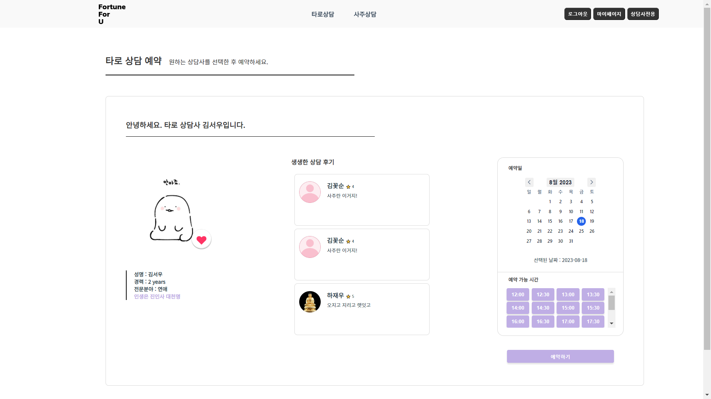
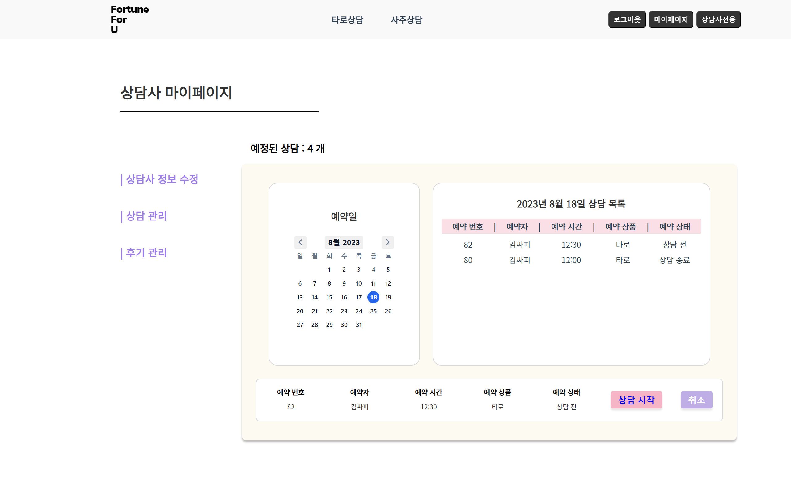
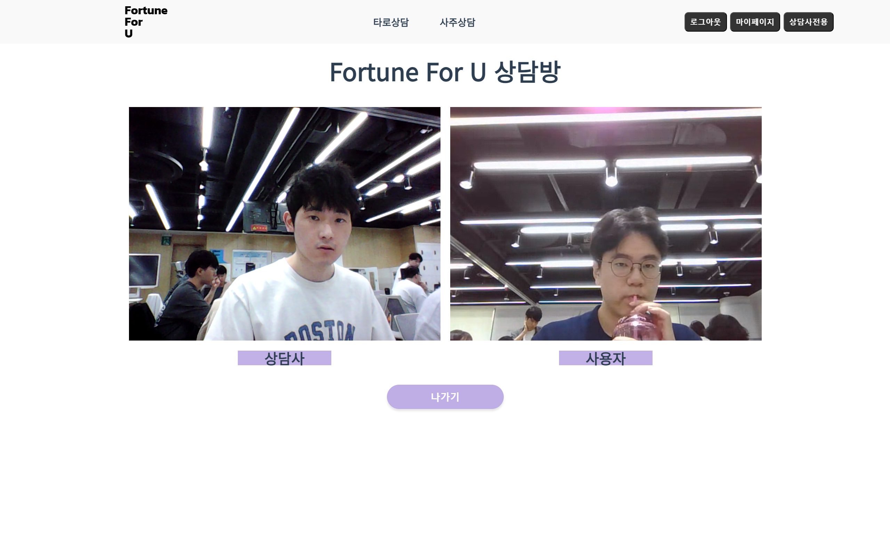
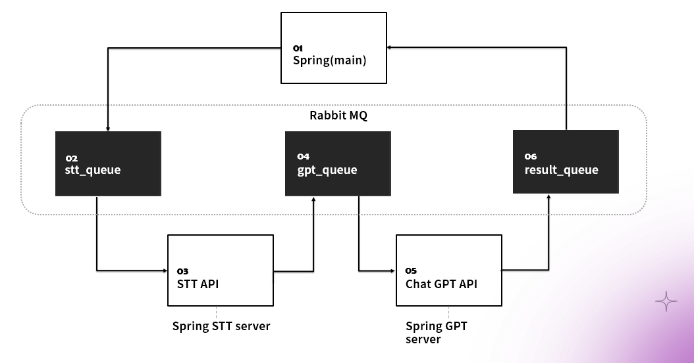

# Fortune For U🔮

<br/>

# 서비스 소개💁
> 언제 어디서든 당신의 운세를 시험해보세요, Fortune For U

<br/>

## 기획 배경

<details>
<summary>내용 보기</summary>
<div markdown="1">
### 시장 조사
- 국내 점술 시장의 규모는 약 1조 4천억으로 추정
  - 기존의 주 수요층이었던 중장년층 뿐만 아니라 MZ세대 또한 점술시장의 주 수요층으로 변화
- **비대면 운세 서비스의 등장**이 수요층의 확대에 크게 기여
  - 전화, 채팅 등의 방식으로 운세 서비스 이용
  - 직접 방문하는 방식이 아닌, **개인적인 공간에서 간편하게 운세 서비스를 이용**할 수 있음
  - 대표적인 비대면 운세 서비스인 '점신'의 경우 **월 약 70만명 이상의 사용자들이 활동**하고 있으며, 2021년 기준 **약 30억원의 매출액**을 달성함

### 기존 비대면 운세 서비스의 문제점
  - 메신저, 전화를 이용한 상담이나 AI 챗봇을 이용한 운세 서비스는 직접 방문하는 것에 비해 **신뢰가 생기지 않음**
  - 메신저를 통한 상담의 경우, **해석을 기다리는 시간이 길게 느껴질 수 있음**
  - 전화를 통한 상담의 경우, **사용자가 해석을 모두 받아적어야 하기 때문에 불편함**
  - **과거의 상담 이력을 조회하기가 힘든 구조임**
</div>
</details>


<br/>

## 기능 소개
### WebRTC 기반의 화상 상담
  - 상담가와 직접 대면함으로써 직접 방문한 것과 같은 현장감을 느낄 수 있는 서비스
  
  
  
### 상담 결과 문서화 및 요약
  - STT(Speech To Text) API를 사용하여 상담 내용을 문서화
  - Chat GPT API를 사용하여 문서화한 상담 내용을 요약
  - 사용자나 상담가가 상담 결과를 기록해야 하는 번거로움을 덜어주는 서비스
  

<br/>

# 시스템 아키텍처📑


<br/>

# Conventions🤙

## Git Convention

<details>
<summary>내용 보기</summary>
<div markdown="1">

### Git Flow 브랜치 전략

- 기능별로 Feature 브랜치를 생성하여 작업
- 완성된 기능은 Develop 브랜치로 merge
- Release 가능한 단위로 Master 브랜치에 병합 -> 버전 관리

### Commit Message- TYPE
```text
    - feat (feature) : 새로운 기능을 추가한 경우
    - fix (bug fix) : 버그를 고친 경우
    - docs (documentation) : 문서를 수정한 경우
    - style (formatting, missing semi colons, …) : 코드 포맷 변경, 세미 콜론 누락 등 기능적 변경이 없는 경우
    - design : ui 변경 (ex. scss, css 를 수정했을 때)
    - refactor : 코드 리팩토링을 한 경우
    - test (when adding missing tests) : 테스트 추가, 테스트 리팩토링을 한 경우
    - comment : 필요 주석 추가 및 변경
    - chore (maintain) : 빌드, 패키지 매니저 설정을 변경한 경우 → gradle 파일 같은 거 수정했을 때??
    - rename : 파일 혹은 폴더명 수정 / 옮기기 작업
    - remove : 파일 삭제
```
### Commit Message - SUBJECT
  - 변경 사항에 대한 간결한 설명

</div>
</details>

## Code Convention

### JavaScript
- [JavaScript 코드 컨벤션은 해당 링크의 내용을 준수한다.](https://github.com/naver/yobi/blob/master/docs/ko/technical/javascript-naming-convention.md)
### Java
- [Java 코드 컨벤션은 해당 링크의 내용을 준수한다.](https://naver.github.io/hackday-conventions-java/)


<br/>

## 기술 스택🛠️
### Front-end
<p>


</p>

### Back-end
<p>


</p>

### Infra
<p>


</p>


### Project Management
<p>


</p>

<br/>

## 팀원 소개👨‍👩‍👧‍👦
<table>
  <tbody>
    <tr>
      <td align="center"><a href=""><br /><sub><b>팀장 : 정지원</b></sub></a><br /></td>
      <td align="center"><a href=""><br /><sub><b>팀원 : 강인영</b></sub></a><br /></td>
      <td align="center"><a href=""><br /><sub><b>팀원 : 김승욱</b></sub></a><br /></td>
     <tr/>
      <td align="center"><a href=""><br /><sub><b>팀원 : 김혜진</b></sub></a><br /></td>
      <td align="center"><a href=""><br /><sub><b>팀원 : 박소윤</b></sub></a><br /></td>
      <td align="center"><a href=""><br /><sub><b>팀원 : 하재우</b></sub></a><br /></td>
    </tr>
  </tbody>
</table>
